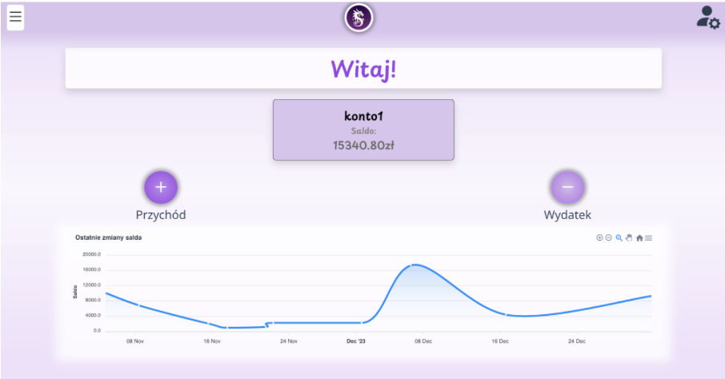

# Flame-Funds: Engineering thesis
# PHP (Symfony), JavaScript (Vue.js), SQL, Docker, Git

Amidst soaring prices and inflation, effective personal finance management is pivotal for achieving stability. As digitization surges, demand for innovative financial planning tools rises. This calls for modern solutions that are convenient, accessible, and reliable across devices and locations. 
This project aimed to design and implement a household budget management app to aid financial decision-making. Technologies like PHP with Symfony, and JavaScript with Vue.js were chosen for their popularity and coherence.
Key modules include transaction input, periodic payments, financial goals, accounts, report generation, Google Sheets integration, and transaction history access, ensuring comprehensive financial management.
Security measures include server and client-side form validation, hashed passwords, and JWT token authentication. Unit tests were conducted to ensure system accuracy.

## Functional requirements

Functional requirements are a key part of an information system specification. They define what activities the system must perform in order to meet user expectations and meet the business objectives of the project.  The functional requirements of the application are listed below.

- Registration.
- Login.
- Adding expense and income.
  - Entering the transaction amount.
  - Selecting the date of the transaction.
  - Selecting a transaction category.
  - Adding a new transaction category.
  - Adding optional transaction details.
- Adding a financial goal.
  - Adding the starting and ending amount of the financial goal.
  - Adding the start and end date of the financial goal.
  - Adding optional details of the financial goal.
- Adding a periodic payment.
  - Adding the amount of the periodic payment.
  - Adding the start and end date of the periodic payment.
  - Adding the recurrence frequency of the periodic payment.
  - Adding optional details of periodic payment.
- Generating annual and quarterly financial reports.
- Adding an account.
  - Adding the initial balance of the account.
  - Checking the balance of an account.
- Viewing history
  - View income, expenses, financial goals and periodic payments.
- Deleting user actions.
- Edit user actions.
- Access and actions in a Google spreadsheet.

## Nonfunctional requirements

- Server side:
  - JWT token-based authentication and authorization mechanism (JSON Web Token),
  - MySQL relational database storage,
  - password hashing,
  - server-side form validation, 
  - access to Google spreadsheets,
  - data synchronization capability,
  - 99% uptime availability,
  - responses to user requests in no more than 40 seconds,
  - use of server-level security to protect data.

- Client side:
  - operation on devices with Internet access,
  - supported browsers: all with support for HTML5, CSS3 and JavaScript in at least ES2015 standard,
  - responsive interface,
  - client-side form validation,
  - transparency and intuitiveness of the interface,
  - support for the Polish language and the Polish zloty currency,
  - extensive notifications about actions occurring in the application.

## Register

The application's registration and login modules play a key role in ensuring security and access to individual features for registered users. In order to access all features of the application, an account must be created. The registration process involves providing a username, email address, password and its confirmation. When data validation is successfully completed, a new user is registered, enrolled in the database and a message is displayed indicating success. On the other hand, when the validation is unsuccessful, a pop-up notification asks to correct the entered data.

## Login

To log in to the created account, you need to enter your e-mail address and password. If the correct information stored in the database is provided, you are redirected to the application's main screen.

## Main Screen

Harmonogram	

- 03.10.2023	 Wybór technologii

- 10.10.2023	 Konteneryzacja bazy danych, phpmyadmin, projektu symfony, projektu vue

- 17.10.2023	 Utworzenie struktury danych w bazie oraz dodanie autoryzacji tokenami JWT

- 24.10.2023	 Utworzenie widoków aplikacji oraz logiki logowanie i rejestracji

- 31.10.2023	 Dodanie funkcjonalności kont, wydatków oraz przychodów i historii

- 07.11.2023   Integracja projektu z Google Workspace (Google Sheets oraz Google Drive)

- 14.11.2023	 Dodanie funkcjonalności celów finansowych oraz płatności cyklicznych.

- 21.11.2023	 Dodanie mechaniki raportowania

- 28.11.2023	 Testowanie i debugowanie

- 05.12.2023	 Oddanie projektu

